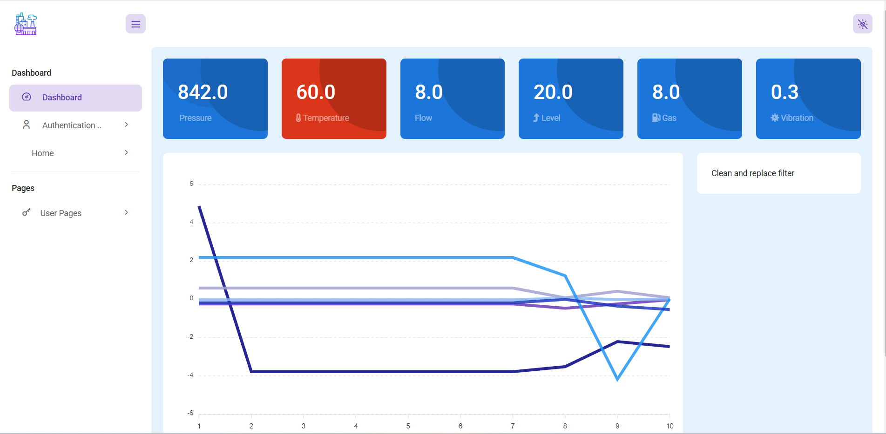
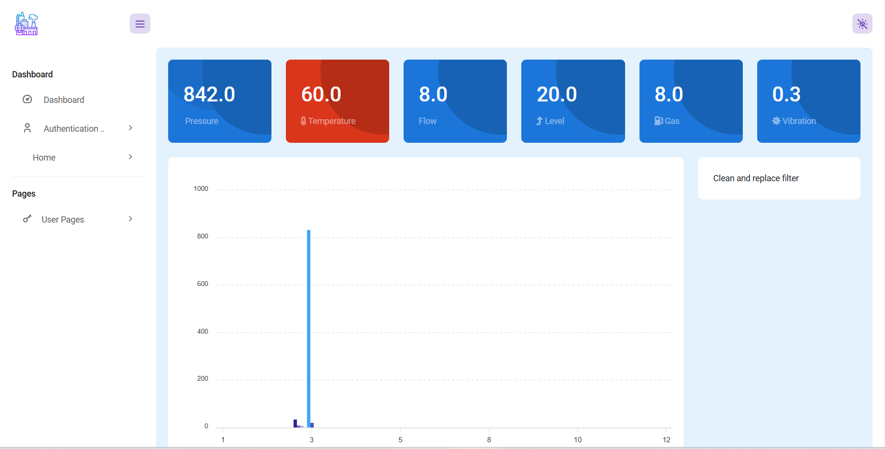

Idea description: 
Our Idea overs both hardware and software aspects; sensors to be put on machines, collecting data to be sent to the software where the AI model will be interpreting the data and predicting the anomalies so that the administrator can know the failing piece of the machine to either repair it or change it in order to avoid big losses, The AI model also suggests some possible solutions to solve the problem.

